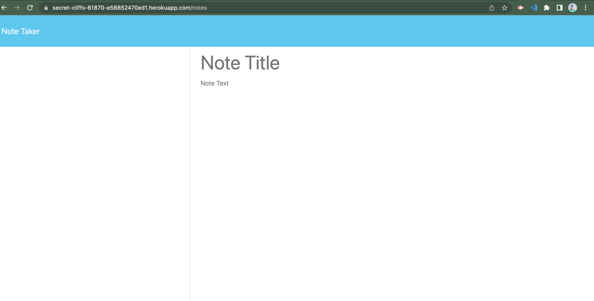

# Note Taker Challenge

## Description

The Note Taker application allows users to input tasks they need to complete. Their note consists of a title of the task and a description of the task. After writing down a chore, the user can save the task and it is saved and displayed on the side of the web page.

## Installation

You can clone or fork this repository to contribute to the app.

[Note Taker App](https://secret-cliffs-61870-e58852470ed1.herokuapp.com/notes)

## Credits

Cloned the starter code from the miniature-eureka repository.

## License

An ISC License is applied to this application.